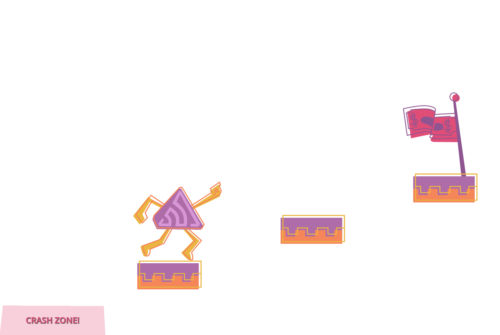

# Sentry Demo for Godot Engine

A sample Godot game called "Sentry Jump". The updated demo project lives in the `godot-4.5` branch. The new version utilizes upcoming Godot 4.5 features that introduce Logger interface and allow script stack traces with local/member variables. It requires [Godot 4.5-dev4](https://godotengine.org/article/dev-snapshot-godot-4-5-dev-4/) or newer. The updated demo can also be played automatically if launched with `--automate` argument. The `tools` directory hosts precompiled Godot builds that can be used to edit or run the demo project.

## Talk slides

https://docs.google.com/presentation/d/1mU0HEeOpR0whLYLtfTzlbiIXN4wYUssLNChutvJAeJQ
