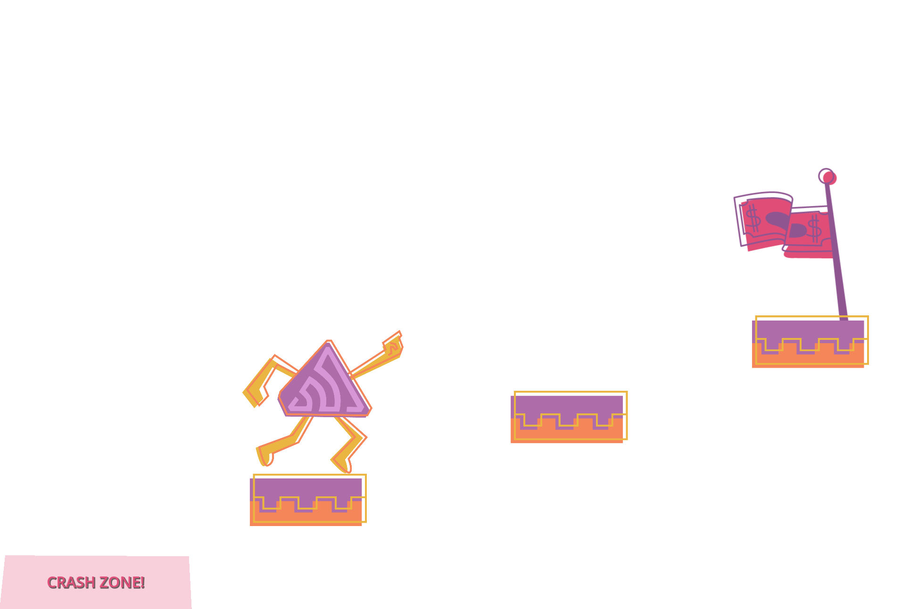
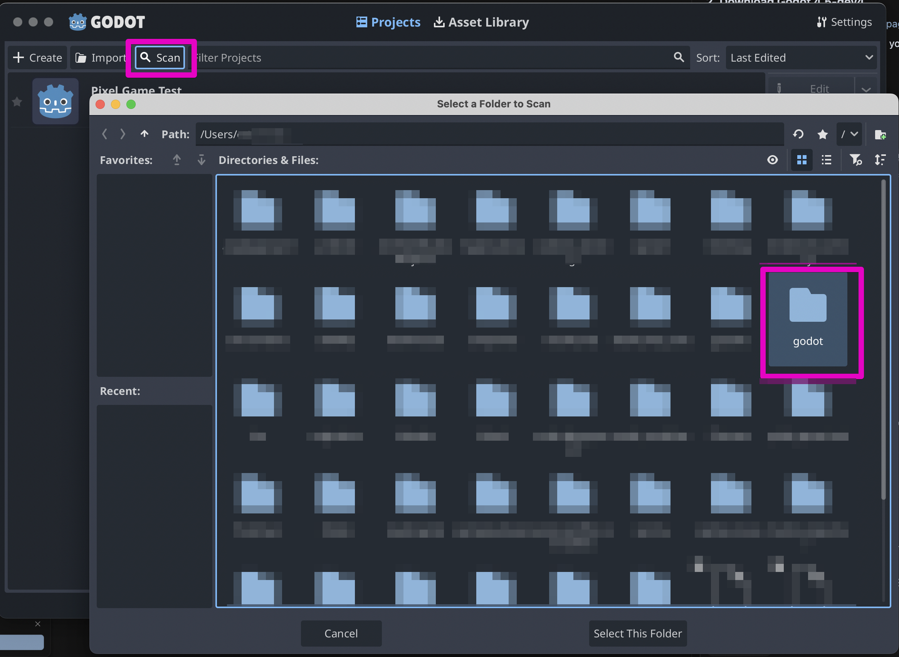
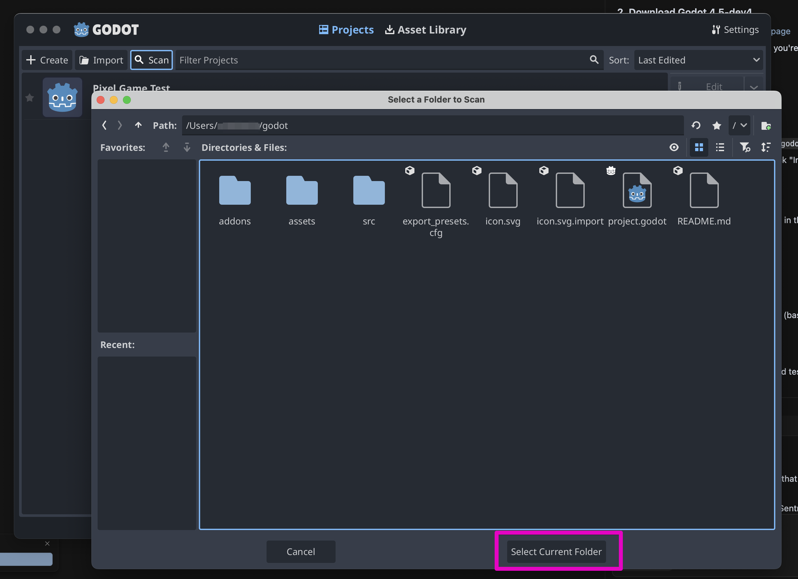
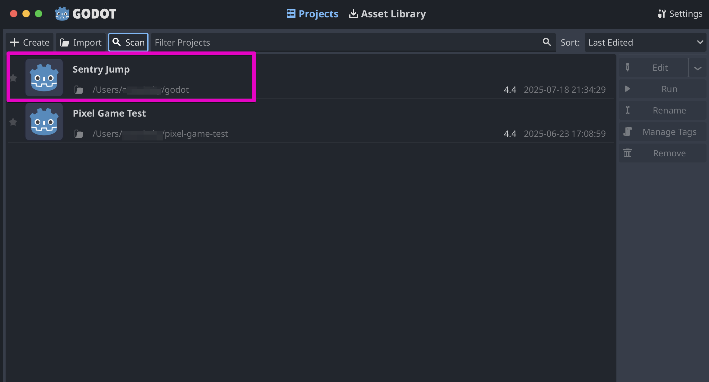
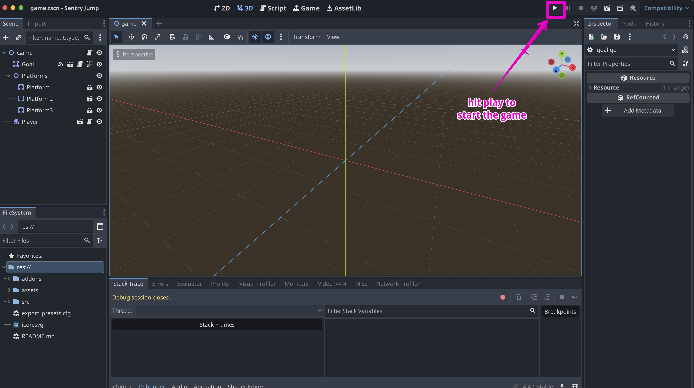
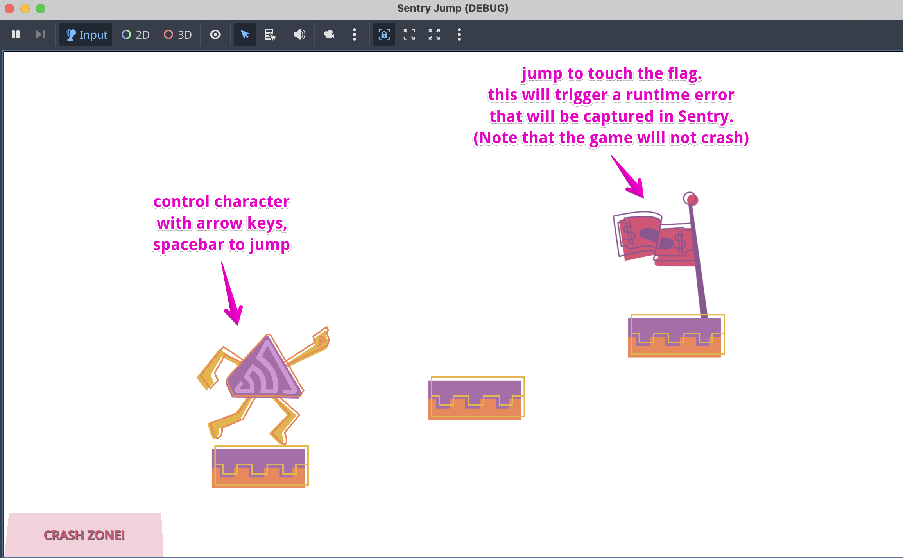
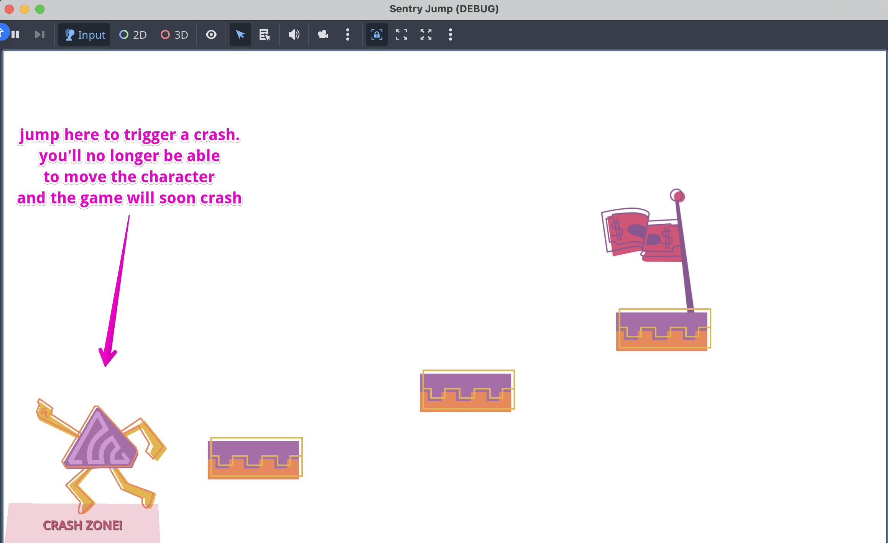
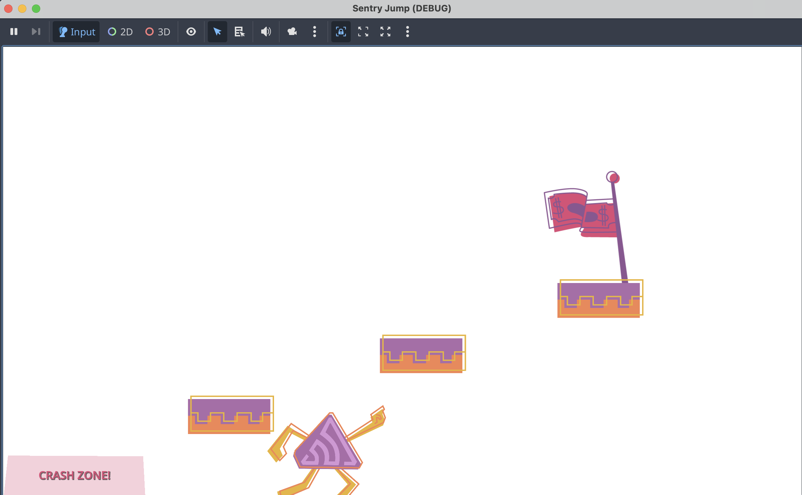
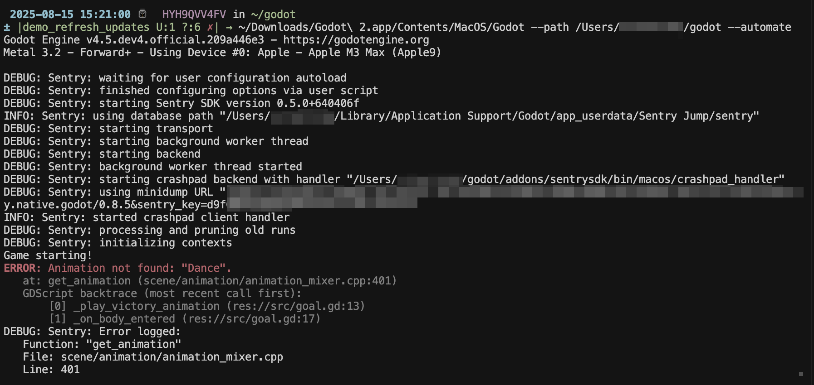

# Sentry Demo for Godot Engine

A sample Godot game called "Sentry Jump". The updated demo project lives in the `godot-4.5` branch. The new version utilizes upcoming Godot 4.5 features that introduce Logger interface and allow script stack traces with local/member variables. It requires [Godot 4.5-dev4](https://godotengine.org/article/dev-snapshot-godot-4-5-dev-4/) or newer. The updated demo can also be played automatically if launched with `--automate` argument. The `tools` directory hosts precompiled Godot builds that can be used to edit or run the demo project.



## Getting Started (No Godot Experience Required)

If you're new to Godot, follow these simple steps to run the demo:

### Prerequisites

- Download and install [Godot 4.5-dev4](https://godotengine.org/article/dev-snapshot-godot-4-5-dev-4/#downloads) or newer for your operating system
- Extract the Godot executable (Godot.app) to a location on your computer
- Clone this demo repo locally (`git clone git@github.com:sentry-demos/godot.git`)

### Step 1: Open Godot

1. Launch Godot from your downloaded location

### Step 2: Import the Project

1. In the Project Manager, click the **"Scan"** button (highlighted in the left panel)
2. In the file browser dialog that appears, navigate to the folder containing this project
3. Select/double-click the folder that contains `project.godot`, `README.md`, and the `src` folder
4. Click **"Select Current Folder"** to import the project





### Step 3: Open the Project

1. Once imported, you'll see "Sentry Jump" appear in your project list
2. Select the "Sentry Jump" project (it will be highlighted)
3. Click **"Edit"** to open the project in the Godot editor



### Step 4: Run the Game

1. In the Godot editor, you'll see various panels and a 3D viewport
2. Look for the **Play button** (▶️) in the top-right corner of the editor
3. Click the **Play button** to start the game



### Step 5: Play the Demo And Trigger a Runtime Error

**Game Controls:**

- **Arrow keys**: Move the character left/right
- **Spacebar**: Jump
- **F key**: Toggle fullscreen mode
- **R key**: Reset the scene

**Objective:** Jump to the red flag on the right. When you reach it, the demo will intentionally cause a runtime error (not crash) to showcase Sentry's error reporting capabilities!

**Note:** Most errors developers deal with in Godot are runtime non-crash errors. This is because the game logic is usually implemented in a scripting language, and 99% of the time errors don’t cause a crash.



### (Optional) Step 6: Jump Into the Crash Zone to trigger a crash

When the player jumps into the "Crash Zone," the game triggers a crash in the `C++` gamelogic library. This is meant to illustrate a crash connected to some native code.



### (Extremely Optional) Step 7: Fall off the platform to trigger another runtime error

If the player goes off the platform and falls down, they reach the limits of the level, resulting in another runtime error.

**Note:** (I'd skip this during a live demo. It's redundant since you already jumped to the flag to generate a runtime error, but you can do it if you want an additional runtime error for any reason)



### Troubleshooting

- If you get import errors, ensure you're using Godot 4.5-dev4 or newer
- Make sure you're selecting the folder that contains `project.godot`, not a subfolder
- The game window may appear behind the editor - check your taskbar/dock

## Advanced Usage

### Automate the game without opening Godot Studio

You can also run the game (and make the character jump to the flag) from the command line. This is used to generate bulk demo data, I recommend against running this in a live demo context.

```bash
# On macOS
$ /Users/yourname/Downloads/Godot.app/Contents/MacOS/Godot --path /path/to/sentry-demos/godot/directory/you/cloned --automate
```



## Talk slides

https://docs.google.com/presentation/d/1mU0HEeOpR0whLYLtfTzlbiIXN4wYUssLNChutvJAeJQ
